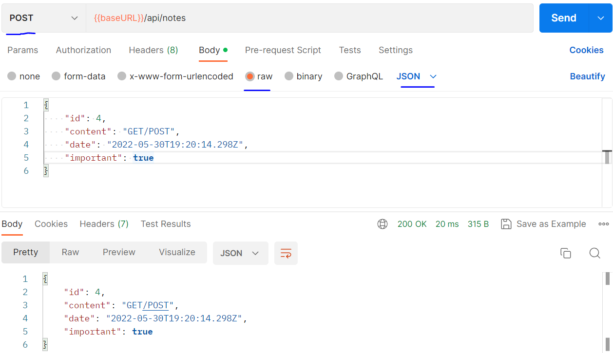

# part3

#### Node基础

```js
// 导入Node内置的网络服务器
const http = require('http')

// createServer 方法来创建一个新的网络服务器。一个 事件处理程序 被注册到服务器上，
// 每当 HTTP 请求被发送到服务器的地址 http://localhost:3001，该程序就会被调用。
const app = http.createServer((request, response) => {
  response.writeHead(200, { 'Content-Type': 'text/plain' })
  response.end('Hello World')
})

const PORT = 3001
app.listen(PORT)
console.log(`Server running on port ${PORT}`)
```

Node 现在也支持使用 ES6 模块，但由于支持还 [不是很完善](https://nodejs.org/api/esm.html#modules-ecmascript-modules)，我们将坚持使用 CommonJS 模块。

#### Express

```js
const express = require("express")
const app = express()

let notes = [
    {
      id: 1,
      content: "HTML is easy",
      date: "2022-05-30T17:30:31.098Z",
      important: true
    },
    {
      id: 2,
      content: "Browser can execute only Javascript",
      date: "2022-05-30T18:39:34.091Z",
      important: false
    },
    {
      id: 3,
      content: "GET and POST are the most important methods of HTTP protocol",
      date: "2022-05-30T19:20:14.298Z",
      important: true
    }
  ]

app.get('/', (req, resp) => {
    resp.send('<h1>Hello Node</h1>')
})

app.get('/api/notes', (req, resp) => {
    resp.json(notes)
})

const PORT = 3001
app.listen(PORT, () => {
    console.log(`Server running on port ${PORT}`)
})
```

#### REST

|   URL    |  verb  | functionality                                                |
| :------: | :----: | :----------------------------------------------------------- |
| notes/10 |  GET   | fetches a single resource                                    |
|  notes   |  GET   | fetches all resources in the collection                      |
|  notes   |  POST  | creates a new resource based on the request data             |
| notes/10 | DELETE | removes the identified resource                              |
| notes/10 |  PUT   | replaces the entire identified resource with the request data |
| notes/10 | PATCH  | replaces a part of the identified resource with the request data |

```js
const express = require("express")
const app = express()

app.use(express.json())

let notes = [
    {
      id: 1,
      content: "HTML is easy",
      date: "2022-05-30T17:30:31.098Z",
      important: true
    },
    {
      id: 2,
      content: "Browser can execute only Javascript",
      date: "2022-05-30T18:39:34.091Z",
      important: false
    },
    {
      id: 3,
      content: "GET and POST are the most important methods of HTTP protocol",
      date: "2022-05-30T19:20:14.298Z",
      important: true
    }
  ]

app.get('/', (req, resp) => {
    resp.send('<h1>Hello Node</h1>')
})

app.get('/api/notes', (req, resp) => {
    resp.json(notes)
})

app.get('/api/notes/:id', (request, response) => {
  const id = Number(request.params.id)
  const note = notes.find(note => note.id === id)

  if(note) {
    response.json(note)
  }

  if(!note) {
    response.status(404).end()
  }
  
})

app.delete('/api/notes/:id', (req, resp) => {
  const id = Number(req.params.id)
  notes = notes.filter(note => note.id !== id)
  resp.status(204).end()
})

app.post('/api/notes', (request, response) => {
  const note = request.body
  console.log(note)
  response.json(note)
})

const PORT = 3001
app.listen(PORT, () => {
    console.log(`Server running on port ${PORT}`)
})
```

如果头中没有正确的值，服务器将不能正确地解析数据。它甚至不会尝试猜测数据的格式，因为有 [大量](https://developer.mozilla.org/en-US/docs/Web/HTTP/Basics_of_HTTP/MIME_types) 潜在的 *Content-Typees*。

#### PostMan - Post



